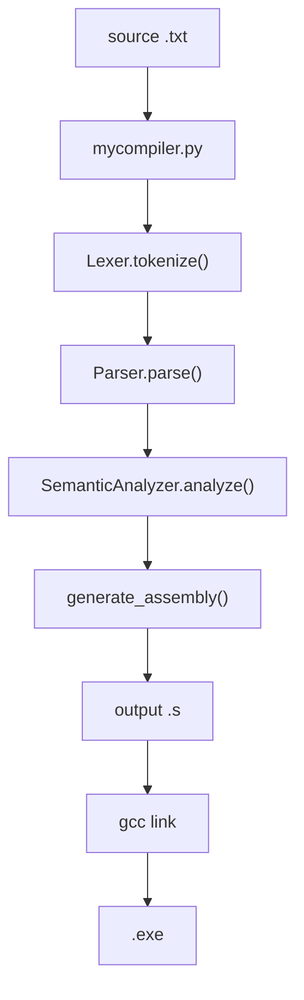

# C 子集源码如何编译成 Windows x86-64 汇编

这份文档从当前仓库的真实代码出发，解释 `myCompiler` 如何把一个教学版 C 子集程序编译成汇编语言。

当前编译器的主入口是 `mycompiler.py`，核心流程分布在：

- `mycompiler.py`：命令行入口和总流水线
- `intermediate.py`：词法分析、语法分析、AST 数据结构
- `semantic.py`：语义分析、符号检查、内建函数检查
- `codegen.py`：Windows x86-64 汇编生成

当前支持的是最小可运行 C 子集，不是完整 C 编译器。输入输出只支持内建函数 `read()` 和 `write(expr)`，不支持源码级 `scanf` / `printf`，也不支持 `cin` / `cout`。

## 1. 编译器整体流程

一次完整编译从源码文件开始，最终生成 `.s` 汇编文件。之后可以用 GCC/MinGW 把 `.s` 链接成 `.exe`。

```text
C 子集源码
  -> Lexer 词法分析
  -> Parser 语法分析，生成 AST
  -> SemanticAnalyzer 语义分析
  -> AssemblyGenerator 汇编生成
  -> .s 汇编文件
  -> gcc 链接
  -> .exe 可执行文件
```



用户看到的命令通常是：

```powershell
python mycompiler.py -S test\test1.txt -o build\test1.s
gcc build\test1.s -o build\test1.exe
@('3','5') | .\build\test1.exe
```

第一条命令由本编译器完成源码到汇编的翻译。第二条命令由 GCC/MinGW 调用汇编器和链接器，把汇编文件和 C 运行库里的 `scanf` / `printf` 等符号链接到一起。第三条命令运行生成的可执行文件。

## 2. 命令行入口：`mycompiler.py`

`mycompiler.py` 是当前完整编译流程的入口。它负责三件事：

1. 解析命令行参数。
2. 读取源码文件。
3. 调用真正的编译流水线并写出汇编。

### 2.1 参数解析

当前参数形式是：

```powershell
python mycompiler.py -S source.txt -o output.s
```

对应代码中的 `parse_args()`：

```python
parser.add_argument("source", help="source .cpp file")
parser.add_argument("-S", action="store_true", help="emit assembly")
parser.add_argument("-o", dest="output", help="output assembly path")
```

参数含义：

- `source`：输入源码路径，例如 `test\test1.txt`
- `-S`：表示只生成汇编文件
- `-o`：指定输出汇编路径，例如 `build\test1.s`

当前版本只支持 `-S`。如果不加 `-S`，程序会直接报错：

```text
error: only -S assembly output is supported in v1
```

也就是说，这个编译器目前不直接生成 `.exe`，它只生成 `.s`。链接 `.exe` 交给 GCC/MinGW。

### 2.2 源码读取

源码读取函数是 `read_source_text()`：

```python
def read_source_text(source_path: Path) -> str:
    try:
        return source_path.read_text(encoding="utf-8-sig")
    except UnicodeDecodeError:
        return source_path.read_text(encoding="gbk")
```

读取策略：

1. 先按 `utf-8-sig` 读取。
2. 如果 UTF-8 解码失败，再按 `gbk` 读取。

这样做是为了兼容测试文件里的中文注释。有些测试文件可能是 UTF-8，有些可能是 GBK。注释本身不会参与编译，但源码文件必须先能被正确读成字符串。

### 2.3 总编译流水线

真正的编译过程在 `compile_source()` 中：

```python
def compile_source(source_text: str) -> str:
    lexer = Lexer(source_text)
    tokens = lexer.tokenize()
    if lexer.errors:
        raise CompileFailure("lexical errors:\n" + "\n".join(lexer.errors))

    try:
        ast = Parser(tokens).parse()
    except ParserError as exc:
        raise CompileFailure(str(exc)) from exc

    semantic_result = SemanticAnalyzer(ast).analyze()
    if semantic_result.errors:
        ...
        raise CompileFailure("semantic errors:\n" + formatted)

    try:
        return generate_assembly(ast)
    except CodegenError as exc:
        raise CompileFailure(str(exc)) from exc
```

可以把它理解成四个阶段：

1. `Lexer(source_text).tokenize()`：字符流变成 token 流。
2. `Parser(tokens).parse()`：token 流变成 AST。
3. `SemanticAnalyzer(ast).analyze()`：检查 AST 是否语义合理。
4. `generate_assembly(ast)`：把 AST 翻译成汇编文本。

任何阶段失败都会抛出 `CompileFailure`，然后 `main()` 把错误打印到标准错误并返回非 0 状态码。

## 3. 词法分析：源码字符变成 Token

词法分析器在 `intermediate.py` 的 `Lexer` 类中。它的任务是把源码字符串拆成一串 token。

例如源码：

```c
int a = read();
write(a + 1);
```

大致会被拆成：

```text
int
a
=
read
(
)
;
write
(
a
+
1
)
;
```

注意：这里为了说明方便，每行写一个 token。真实 token 对象还包含 token code 和行号。

### 3.1 Lexer 保存的状态

`Lexer.__init__()` 保存几个核心状态：

```python
self.source = source
self.pos = 0
self.line = 1
self.errors = []
```

含义：

- `source`：完整源码字符串。
- `pos`：当前扫描到第几个字符。
- `line`：当前行号，用于报错。
- `errors`：词法错误列表。

`current()` 返回当前位置字符，`peek()` 查看下一个字符，`advance()` 前进一个字符并维护行号。

### 3.2 主扫描循环

主循环在 `tokenize()` 中：

```python
while not self.at_end():
    self.skip_whitespace_and_comments()
    if self.at_end():
        break

    ch = self.current()
    if ch.isalpha() or ch == "_":
        tokens.append(self.read_identifier())
    elif ch.isdigit():
        tokens.append(self.read_number())
    elif ch == "'":
        token = self.read_char()
    elif ch == '"':
        token = self.read_string()
    else:
        token = self.read_operator()
```

它从左到右扫描源码，每次根据当前字符决定读哪一种 token。

### 3.3 跳过空白、注释和 `#` 行

`skip_whitespace_and_comments()` 会跳过：

- 空格
- 制表符
- 换行
- `//` 单行注释
- `/* ... */` 多行注释
- `#` 开头的行

当前编译器没有真正实现 C 预处理器。遇到 `#include <stdio.h>` 这类行时，词法分析器只是把整行跳过。也就是说：

- 它不会打开头文件。
- 它不会展开宏。
- 它不会解析 `#define`。

这对当前测试足够，因为当前语言子集不依赖头文件。

### 3.4 关键字和标识符

`read_identifier()` 会读取由字母、数字、下划线组成的连续文本：

```python
while not self.at_end() and (self.current().isalnum() or self.current() == "_"):
    self.advance()
```

读完后查 `KEYWORDS`：

```python
KEYWORDS = {
    "char": 101,
    "int": 102,
    "float": 103,
    "break": 104,
    "const": 105,
    "return": 106,
    "void": 107,
    "continue": 108,
    "do": 109,
    "while": 110,
    "if": 111,
    "else": 112,
    "for": 113,
}
```

如果文本在关键字表里，就是关键字 token；否则就是普通标识符 token。

例如：

- `int` 是关键字。
- `return` 是关键字。
- `main` 是标识符。
- `sum` 是标识符。
- `read` 是标识符。
- `write` 是标识符。

`read` 和 `write` 不是词法关键字，它们在语法上先被当作普通函数调用，后续语义分析阶段再识别为内建函数。

### 3.5 数字

`read_number()` 支持：

- 十进制整数，例如 `123`
- 十六进制整数，例如 `0x10`
- 带小数点的数字 token，例如 `1.5`

但需要注意：当前后端只支持 `int` / `char` 的代码生成。即使词法分析能识别浮点 token，后续语义或代码生成阶段也不把 `float/double` 当成可运行功能。

### 3.6 字符常量和字符串

字符常量由 `read_char()` 处理，例如：

```c
'a'
'\n'
```

字符串由 `read_string()` 处理，例如：

```c
"hello"
```

当前后端不支持字符串表达式和字符串输出。因此字符串能被词法阶段识别，但不能作为当前最小编译器的可运行输出能力。

### 3.7 运算符和分隔符

单字符 token 包括：

```text
( ) [ ] ! * / % + - < > = { } ; ,
```

双字符 token 包括：

```text
<= >= == != && || << >> ::
```

其中 `<<`、`>>`、`::` 是历史上兼容 C++ 风格输入输出时留下的词法能力，但当前 parser 已经不支持 `cin` / `cout` 语法。也就是说，词法层能拆出这些 token，不代表语言层支持它们。

## 4. 语法分析：Token 变成 AST

语法分析器在 `intermediate.py` 的 `Parser` 类中。它使用递归下降方式解析 token 流，并生成 AST。

AST 是抽象语法树。源码中成对的括号、分号、运算符优先级等语法细节，会被整理成更适合后续分析和代码生成的树结构。

### 4.1 AST 节点结构

AST 节点定义如下：

```python
@dataclass
class ASTNode:
    kind: str
    line: Optional[int] = None
    value: Optional[str] = None
    type_name: Optional[str] = None
    name: Optional[str] = None
    children: List["ASTNode"] = field(default_factory=list)
```

字段含义：

- `kind`：节点类型，例如 `FunctionDef`、`VarDecl`、`Operator`。
- `line`：源码行号。
- `value`：字面量或运算符值，例如 `+`、`123`。
- `type_name`：类型名，例如 `int`。
- `name`：函数名、变量名、参数名。
- `children`：子节点列表。

### 4.2 顶层解析

入口是 `Parser.parse()`：

```python
def parse(self) -> ASTNode:
    children: List[ASTNode] = []
    while not self.is_eof():
        if self.current().lexeme == "using":
            self.parse_using_directive()
        elif self.current().lexeme == "const":
            children.extend(self.parse_const_decl())
        elif self.is_type_token(self.current()):
            children.extend(self.parse_toplevel_type_stmt())
        elif self.current().lexeme == "main":
            children.extend(self.parse_implicit_int_main())
        ...
    return ASTNode("Program", children=children)
```

顶层最终生成一个 `Program` 节点，所有全局声明、函数声明、函数定义都是它的子节点。

当前顶层主要支持：

- 全局变量声明
- 常量声明
- 函数声明
- 函数定义
- 特殊的 `main()` 省略返回类型写法

### 4.3 函数声明和函数定义

以类型开头的顶层结构由 `parse_toplevel_type_stmt()` 处理。

例子：

```c
int sum(int,int);
int sum(int a, int b) {
    return a + b;
}
```

解析逻辑：

1. 先读类型，例如 `int`。
2. 再读名字，例如 `sum`。
3. 如果后面是 `(`，说明这是函数声明或函数定义。
4. 读参数列表。
5. 如果后面是 `;`，生成 `FunctionDecl`。
6. 否则解析函数体 `{ ... }`，生成 `FunctionDef`。

函数声明允许参数没有名字：

```c
int sum(int,int);
```

函数定义要求参数有名字：

```c
int sum(int a, int b) {
    return a + b;
}
```

这是因为函数声明只需要描述签名，函数定义里的参数需要在函数体里作为变量使用。

### 4.4 `main()` 省略返回类型

当前 parser 有一个特殊函数 `parse_implicit_int_main()`，用于支持：

```c
main() {
    write(1);
}
```

它会把这种写法按 `int main()` 处理。当前测试已经改成标准的：

```c
int main() {
    ...
}
```

但保留 `main()` 支持可以兼容旧教学用例。

### 4.5 变量声明

变量声明最终生成 `VarDecl` 节点。

例如：

```c
int a = 1;
int b;
```

大致 AST：

```text
VarDecl(name=a, type_name=int)
  Leaf(value=1)
VarDecl(name=b, type_name=int)
```

如果变量有初始化表达式，初始化表达式会作为 `VarDecl` 的子节点。

### 4.6 复合语句

花括号语句块：

```c
{
    int a = 1;
    write(a);
}
```

会生成 `Compound` 节点。`Compound` 的子节点是块内的声明和语句。

语义分析阶段会为复合语句创建新的作用域。代码生成阶段会用作用域栈查找局部变量。

### 4.7 语句解析

`parse_statement()` 根据当前 token 的文本决定解析哪种语句：

- `{ ... }` -> `Compound`
- `if (...) ... else ...` -> `IfStmt`
- `while (...) ...` -> `WhileStmt`
- `for (...; ...; ...) ...` -> `ForStmt`
- `do ... while (...);` -> `DoWhileStmt`
- `return expr;` -> `ReturnStmt`
- `break;` -> `BreakStmt`
- `continue;` -> `ContinueStmt`
- 其他情况 -> `ExprStmt`

`read()` 和 `write(expr)` 不再作为特殊语句解析。它们会被解析成普通函数调用：

```text
Call(name=read)
Call(name=write)
```

后续语义分析和代码生成阶段再把它们识别为内建函数。

### 4.8 表达式优先级

表达式解析使用递归下降，并按优先级分层：

```text
=
||
&&
== !=
< <= > >=
+ -
* / %
! - +
函数调用
变量 / 常量 / 括号
```

例如：

```c
a = b + c * 2;
```

会被解析成类似：

```text
Operator("=")
  Leaf("a")
  Operator("+")
    Leaf("b")
    Operator("*")
      Leaf("c")
      Leaf("2")
```

这棵树表达了正确的优先级：先算 `c * 2`，再和 `b` 相加，最后赋值给 `a`。

### 4.9 函数调用

`parse_postfix()` 处理函数调用：

```c
sum(a, b)
read()
write(a + 1)
```

它先解析出一个基础表达式，例如 `sum`，如果后面遇到 `(`，就把它变成 `Call` 节点。

例子：

```text
Call(name=sum)
  Leaf(a)
  Leaf(b)
```

## 5. 语义分析：检查程序是否合理

语义分析器在 `semantic.py` 的 `SemanticAnalyzer` 中。它的输入是 AST，输出是 `AnalysisResult`：

```python
@dataclass
class AnalysisResult:
    errors: List[Tuple[int, int]]
    const_table: str
    var_table: str
    function_table: str
```

当前 `mycompiler.py` 主要使用 `errors`。如果有语义错误，编译停止，不生成汇编。

### 5.1 作用域

语义分析会维护作用域：

- 全局作用域
- 函数作用域
- 复合语句块作用域

`Scope` 结构：

```python
@dataclass
class Scope:
    id: int
    parent: Optional["Scope"]
    names: Dict[str, "Symbol"] = field(default_factory=dict)
```

每个作用域保存当前层级声明的名字。查找变量时，从当前作用域开始，找不到就向父作用域继续找。

### 5.2 符号

普通变量和常量使用 `Symbol`：

```python
@dataclass
class Symbol:
    name: str
    type_name: str
    line: int
    scope_id: int
    kind: str
    role: str
```

含义：

- `name`：变量名或常量名。
- `type_name`：类型。
- `line`：声明行号。
- `scope_id`：所属作用域。
- `kind`：`var` 或 `const`。
- `role`：`global`、`local`、`param` 等。

函数使用单独的 `FunctionSymbol`：

```python
@dataclass
class FunctionSymbol:
    name: str
    return_type: str
    line: int
    param_types: List[str]
    status: str
```

`status` 用来区分函数只是声明还是已经定义。

### 5.3 变量相关检查

语义分析会检查：

- 同一个作用域内不能重复定义同名变量。
- 使用变量前必须声明。
- 常量不能被赋值。
- 赋值左边必须是合法左值。

例如：

```c
int a;
a = 1;
```

这是合法的。

```c
a = 1;
```

如果之前没有声明 `a`，语义分析会报未声明错误。

```c
const int a = 1;
a = 2;
```

会报常量赋值错误。

### 5.4 函数相关检查

函数检查包括：

- 函数声明和定义的返回类型、参数类型必须一致。
- 函数不能重复定义。
- 函数调用时必须已经声明或定义。
- 调用参数数量必须匹配。
- 调用参数类型必须匹配。
- 非 `void` 函数需要有效 `return`。

例子：

```c
int sum(int,int);

int main() {
    write(sum(1, 2));
}

int sum(int a, int b) {
    return a + b;
}
```

语义分析会记录 `sum` 的签名，然后检查 `sum(1, 2)` 的参数数量和类型。

### 5.5 `main` 的返回值

当前语义规则允许 `main` 自然结束：

```c
int main() {
    write(1);
}
```

即使没有显式 `return 0;`，语义分析也不会报返回值错误。汇编生成阶段会在 `main` 末尾补一条：

```asm
xor eax, eax
```

这表示把返回值设置为 `0`。

### 5.6 内建函数 `read` 和 `write`

当前 I/O 是两个内建函数：

```c
int a = read();
write(a);
```

语义规则：

- `read()` 不允许参数。
- `read()` 返回 `int`。
- `write(expr)` 必须且只能有一个参数。
- `write(expr)` 的参数必须是 `int`。
- `write(expr)` 返回 `void`。
- 用户不能重新声明或定义 `read` / `write`。

这意味着下面是非法的：

```c
int read() {
    return 1;
}
```

下面也是非法的：

```c
write();
write(1, 2);
write('a');
read(1);
```

## 6. 汇编生成总览

汇编生成在 `codegen.py` 中，入口函数是：

```python
def generate_assembly(root) -> str:
    return AssemblyGenerator().generate(root)
```

核心类是 `AssemblyGenerator`。

### 6.1 `generate()` 的三个主要步骤

`AssemblyGenerator.generate()` 做三件事：

```python
self.collect_toplevel(root.children)
self.lines = []
self.emit_header()
self.emit_globals()
self.emit_text(root.children)
```

具体含义：

1. `collect_toplevel()`
   - 收集函数信息。
   - 收集全局变量信息。
   - 为后续代码生成做准备。
2. `emit_header()` 和 `emit_globals()`
   - 输出汇编头部。
   - 输出格式字符串。
   - 输出全局变量。
3. `emit_text()`
   - 输出每个函数的机器指令文本。

最终 `self.lines` 被拼成一个完整字符串返回给 `mycompiler.py`，再写入 `.s` 文件。

### 6.2 汇编文件的主要区段

生成的汇编大致包含：

```asm
.intel_syntax noprefix
.extern printf
.extern scanf
.section .rdata
...

.data
...

.text
...
```

各部分含义：

- `.intel_syntax noprefix`
  - 使用 Intel 风格汇编语法。
  - 寄存器写作 `eax`，不是 AT&T 风格的 `%eax`。
- `.extern printf`
  - 声明 `printf` 是外部符号，链接时由 C 运行库提供。
- `.extern scanf`
  - 声明 `scanf` 是外部符号。
- `.section .rdata`
  - 只读数据区，放格式字符串。
- `.data`
  - 可写数据区，放全局变量。
- `.text`
  - 代码区，放函数指令。

### 6.3 格式字符串

`emit_header()` 会生成：

```asm
.Lfmt_read_int:
    .asciz "%d"
.Lfmt_read_char:
    .asciz " %c"
.Lfmt_write_int:
    .asciz "%d"
.Lfmt_write_char:
    .asciz "%c"
```

当前 `read()` / `write(expr)` 只使用 `int` 版本：

- `.Lfmt_read_int`
- `.Lfmt_write_int`

`char` 格式字符串保留在后端中，但当前 `write(expr)` 的语义规则只允许 `int`。

## 7. 函数栈帧和调用约定

每个函数都会生成一个独立的栈帧。函数栈帧用于保存：

- 局部变量
- 参数副本
- 表达式临时值
- 函数调用需要的 shadow space

### 7.1 函数基本结构

`emit_function()` 生成的函数大致形态：

```asm
.globl function_name
function_name:
    push rbp
    mov rbp, rsp
    sub rsp, frame_size

    ...

.L_function_name_return:
    mov rsp, rbp
    pop rbp
    ret
```

开头三条是函数序言：

- `push rbp`：保存调用者的栈基址。
- `mov rbp, rsp`：建立当前函数的栈基址。
- `sub rsp, frame_size`：为局部变量、临时槽、调用区域分配空间。

末尾三条是函数尾声：

- `mov rsp, rbp`：释放当前函数栈空间。
- `pop rbp`：恢复调用者的栈基址。
- `ret`：返回调用者。

### 7.2 Windows x64 调用约定

当前生成的是 Windows x86-64 汇编，遵循 Windows x64 调用约定。

整数或指针参数前四个放在：

```text
第 1 个参数: rcx
第 2 个参数: rdx
第 3 个参数: r8
第 4 个参数: r9
```

如果参数是 32 位整数，使用对应的低 32 位寄存器：

```text
ecx
edx
r8d
r9d
```

返回值放在：

```text
eax
```

调用函数前还需要保留 32 字节 shadow space。当前 `prepare_frame()` 会根据最大调用参数数量计算：

```python
frame.call_area_size = 32 + max(0, max_args - 4) * 8
```

这块空间包含：

- Windows x64 必需的 32 字节 shadow space。
- 超过 4 个参数时额外放在栈上的参数空间。

### 7.3 参数如何保存

函数刚进入时，参数在寄存器或调用者栈上。为了后续统一处理，编译器会把参数保存到当前函数自己的栈帧中。

例如：

```c
int sum(int x, int y) {
    return x + y;
}
```

进入 `sum` 时：

- `x` 在 `ecx`
- `y` 在 `edx`

`emit_param_stores()` 会生成类似：

```asm
mov DWORD PTR [rbp-8], ecx
mov DWORD PTR [rbp-16], edx
```

之后函数体里使用 `x` / `y`，就像普通局部变量一样从 `[rbp-8]` / `[rbp-16]` 读取。

## 8. 变量和内存布局

后端用 `VariableInfo` 描述变量：

```python
@dataclass
class VariableInfo:
    name: str
    type_name: str
    line: int
    offset: Optional[int] = None
    global_label: Optional[str] = None
    is_const: bool = False
```

字段含义：

- `name`：变量名。
- `type_name`：类型，例如 `int` 或 `char`。
- `line`：声明行号。
- `offset`：局部变量相对 `rbp` 的偏移。
- `global_label`：全局变量标签。
- `is_const`：是否常量。

### 8.1 局部变量

局部变量放在当前函数栈帧中。典型地址：

```asm
[rbp-8]
[rbp-16]
[rbp-24]
```

当前后端每个局部变量分配 8 字节槽位，即使 `int` 实际只用 4 字节。这让栈布局更简单，也方便对齐。

读取 `int` 变量：

```asm
mov eax, DWORD PTR [rbp-8]
```

写入 `int` 变量：

```asm
mov DWORD PTR [rbp-8], eax
```

读取 `char` 变量：

```asm
movsx eax, BYTE PTR [rbp-8]
```

写入 `char` 变量：

```asm
mov BYTE PTR [rbp-8], al
```

### 8.2 全局变量

全局变量放在 `.data` 段中。

例如：

```c
int a = 1;
```

会生成类似：

```asm
.data
.Lglob_a:
    .long 1
```

读取全局变量时使用 RIP 相对寻址：

```asm
mov eax, DWORD PTR .Lglob_a[rip]
```

写入全局变量：

```asm
mov DWORD PTR .Lglob_a[rip], eax
```

## 9. 表达式如何翻译成汇编

表达式生成入口是 `emit_expression()`。

它根据 AST 节点类型分派：

- `Leaf`：常量或变量
- `Operator`：运算符表达式
- `Call`：函数调用
- `Empty`：空表达式

### 9.1 字面量和变量

整数常量：

```c
123
```

生成：

```asm
mov eax, 123
```

字符常量：

```c
'a'
```

生成：

```asm
mov eax, 97
```

变量：

```c
a
```

如果 `a` 是局部 `int`，生成：

```asm
mov eax, DWORD PTR [rbp-8]
```

当前约定：表达式求值结果通常放在 `eax`。

### 9.2 赋值表达式

源码：

```c
a = b + 1;
```

AST 大致是：

```text
Operator("=")
  Leaf(a)
  Operator("+")
    Leaf(b)
    Leaf(1)
```

代码生成思路：

1. 先生成右侧表达式 `b + 1`，结果放到 `eax`。
2. 找到左侧变量 `a` 的地址。
3. 把 `eax` 写入 `a` 的内存槽。

赋值本身由 `emit_expression()` 中的 `node.value == "="` 分支处理。

### 9.3 二元算术

对于：

```c
b + 1
```

后端的基本策略是：

1. 计算左操作数，结果在 `eax`。
2. 把左操作数保存到临时栈槽。
3. 计算右操作数，结果在 `eax`。
4. 把右操作数复制到 `r10d`。
5. 从临时槽恢复左操作数到 `eax`。
6. 执行具体运算。

类似汇编：

```asm
mov eax, DWORD PTR [rbp-8]     # b
cdqe
mov QWORD PTR [rbp-24], rax    # 保存左操作数
mov eax, 1                     # 右操作数
mov r10d, eax
mov eax, DWORD PTR [rbp-24]    # 恢复左操作数
add eax, r10d
```

不同运算符对应不同指令：

- `+` -> `add eax, r10d`
- `-` -> `sub eax, r10d`
- `*` -> `imul eax, r10d`
- `/` -> `cdq` + `idiv r10d`
- `%` -> `cdq` + `idiv r10d` + `mov eax, edx`

除法和取模都用 `idiv`。`idiv` 会把商放到 `eax`，余数放到 `edx`。因此 `%` 运算最后需要把 `edx` 移回 `eax`。

### 9.4 一元运算

当前支持：

- `+x`
- `-x`
- `!x`

`-x`：

```asm
neg eax
```

`!x`：

```asm
cmp eax, 0
sete al
movzx eax, al
```

`sete al` 表示如果比较结果相等，也就是原值为 0，则把 `al` 设置为 1。否则为 0。

## 10. 比较和逻辑表达式

比较运算包括：

```text
== != < <= > >=
```

例如：

```c
a >= b
```

生成思路：

1. 计算 `a`。
2. 保存 `a`。
3. 计算 `b`。
4. 比较 `a` 和 `b`。
5. 用 `setge` 把比较结果变成 0 或 1。

典型汇编：

```asm
cmp eax, r10d
setge al
movzx eax, al
```

结果统一为：

- 真：`1`
- 假：`0`

逻辑运算包括：

- `&&`
- `||`
- `!`

`!` 已经在一元运算中处理。

`&&` 和 `||` 由 `emit_logical()` 通过标签和跳转生成。以 `&&` 为例：

```text
如果左边为 0 -> 整体为假
否则计算右边
如果右边为 0 -> 整体为假
否则整体为真
```

这会生成类似：

```asm
cmp eax, 0
je logic_false
...
cmp eax, 0
je logic_false
mov eax, 1
jmp logic_end
logic_false:
xor eax, eax
logic_end:
```

## 11. 控制流如何翻译成标签和跳转

控制流的核心思想是：高级语言里的结构化语句，最终都变成标签和跳转。

### 11.1 `if` / `else`

源码：

```c
if (cond)
    stmt1;
else
    stmt2;
```

生成逻辑：

1. 计算条件表达式，结果在 `eax`。
2. `cmp eax, 0`。
3. 如果为 0，跳到 `else` 标签。
4. 生成 then 分支。
5. 跳到结束标签。
6. 生成 else 分支。
7. 放置结束标签。

典型汇编：

```asm
cmp eax, 0
je .L_else
    ...
jmp .L_endif
.L_else:
    ...
.L_endif:
```

### 11.2 `while`

源码：

```c
while (cond) {
    body;
}
```

生成逻辑：

1. 放置循环开始标签。
2. 计算条件。
3. 如果条件为 0，跳到循环结束。
4. 生成循环体。
5. 跳回循环开始。
6. 放置循环结束标签。

典型汇编：

```asm
.L_while_start:
    ...
    cmp eax, 0
    je .L_while_end
    ...
    jmp .L_while_start
.L_while_end:
```

### 11.3 `for`

源码：

```c
for (init; cond; step) {
    body;
}
```

生成顺序：

1. 生成 `init`。
2. 放置 start 标签。
3. 生成 `cond`。
4. 如果条件为假，跳到 end。
5. 生成 body。
6. 放置 step 标签。
7. 生成 `step`。
8. 跳回 start。
9. 放置 end 标签。

这个顺序对应 C 语言 `for` 的执行规则。

### 11.4 `break` 和 `continue`

后端维护一个循环标签栈：

```python
frame.loops.append(LoopLabels(break_label=end_label, continue_label=step_or_start_label))
```

遇到 `break`：

```asm
jmp break_label
```

遇到 `continue`：

```asm
jmp continue_label
```

嵌套循环时，栈顶永远代表当前最内层循环。因此内层 `break` 只跳出内层循环，不会跳出外层循环。

## 12. 函数调用如何生成

普通函数调用由 `emit_call()` 处理。

源码：

```c
sum(a, b)
```

生成过程：

1. 依次计算每个实参。
2. 把每个实参保存到临时槽，避免后一个实参覆盖前一个实参。
3. 按 Windows x64 调用约定放置参数。
4. 执行 `call sum`。
5. 函数返回值位于 `eax`。

### 12.1 为什么要先保存实参

假设：

```c
sum(a + 1, b + 2)
```

如果直接计算第一个参数后马上计算第二个参数，第二个参数会覆盖 `eax`。因此编译器先把每个实参结果保存到当前函数的临时槽。

大致过程：

```text
计算 a + 1 -> eax
保存 eax 到 temp0
计算 b + 2 -> eax
保存 eax 到 temp1
temp0 -> rcx
temp1 -> rdx
call sum
```

### 12.2 前四个参数

前四个参数放入：

```text
rcx, rdx, r8, r9
```

代码里对应：

```python
ARG_REGS_64 = ["rcx", "rdx", "r8", "r9"]
```

超过四个参数的部分放到栈上的调用区域：

```asm
mov QWORD PTR [rsp+32], rax
```

### 12.3 递归为什么能工作

递归调用能工作，是因为每次函数调用都会创建新的栈帧：

- 每次调用都有自己的参数副本。
- 每次调用都有自己的局部变量。
- 返回时恢复上一层调用的 `rbp` 和 `rsp`。

例如组合数测试里的：

```c
a = comp(n-1,i);
b = comp(n-1,i-1);
return a + b;
```

每一层 `comp` 调用都有独立的 `n`、`i`、`a`、`b`。

## 13. `read()` / `write(expr)` 如何生成汇编

当前源码级 I/O 只支持：

```c
read()
write(expr)
```

它们是内建函数，不需要声明。

### 13.1 `read()`

源码：

```c
a = read();
```

生成逻辑：

1. 在当前函数栈帧中使用一个临时槽。
2. 把临时槽地址放入 `rdx`。
3. 把格式字符串 `"%d"` 的地址放入 `rcx`。
4. 调用 `scanf`。
5. 从临时槽读取结果到 `eax`。
6. 如果外层是赋值，再把 `eax` 存入目标变量。

关键汇编形态：

```asm
lea rdx, [rbp-...]
lea rcx, .Lfmt_read_int[rip]
xor eax, eax
call scanf
mov eax, DWORD PTR [rbp-...]
```

为什么要用临时槽？因为 `scanf("%d", &x)` 需要的是地址。`read()` 是表达式，没有用户可见变量地址，所以编译器自己准备一个临时位置给 `scanf` 写入。

### 13.2 `write(expr)`

源码：

```c
write(a + 100);
```

生成逻辑：

1. 先计算 `a + 100`，结果放到 `eax`。
2. 把 `eax` 复制到 `edx`，作为 `printf` 的第二个参数。
3. 把 `"%d"` 的地址放到 `rcx`，作为第一个参数。
4. 调用 `printf`。

关键汇编形态：

```asm
mov edx, eax
lea rcx, .Lfmt_write_int[rip]
xor eax, eax
call printf
```

`write` 不自动输出空格或换行，所以多次输出会连在一起。例如依次输出 `10`、`2`、`3`、`5`、`7`，屏幕上会显示：

```text
102357
```

## 14. 完整例子：从源码到汇编

看一个小程序：

```c
int sum(int x,int y);

int main() {
    int a = read();
    int b = read();
    write(sum(a,b));
}

int sum(int x,int y) {
    return x + y;
}
```

### 14.1 词法分析结果

主要 token 大致是：

```text
int sum ( int x , int y ) ;
int main ( ) {
int a = read ( ) ;
int b = read ( ) ;
write ( sum ( a , b ) ) ;
}
int sum ( int x , int y ) {
return x + y ;
}
```

真实 token 中还包含 token code 和行号。

### 14.2 AST 结构

AST 大致结构：

```text
Program
  FunctionDecl(name=sum, type=int)
    Param(type=int, name=x)
    Param(type=int, name=y)
  FunctionDef(name=main, type=int)
    Compound
      VarDecl(name=a, type=int)
        Call(name=read)
      VarDecl(name=b, type=int)
        Call(name=read)
      ExprStmt
        Call(name=write)
          Call(name=sum)
            Leaf(a)
            Leaf(b)
  FunctionDef(name=sum, type=int)
    Param(type=int, name=x)
    Param(type=int, name=y)
    Compound
      ReturnStmt
        Operator(+)
          Leaf(x)
          Leaf(y)
```

### 14.3 语义分析

语义分析会检查：

- `sum` 声明存在。
- `sum` 定义和声明签名一致。
- `main` 是合法函数。
- `read()` 是内建函数，参数数量为 0，返回 `int`。
- `a` 和 `b` 是局部变量。
- `sum(a,b)` 参数数量为 2，参数类型为 `int`。
- `write(sum(a,b))` 参数数量为 1，参数类型为 `int`。
- `sum` 的返回表达式 `x + y` 类型为 `int`。

### 14.4 汇编生成重点

生成文件会包含：

```asm
.intel_syntax noprefix
.extern printf
.extern scanf
.section .rdata
...
.text
...
```

`main` 函数里会出现：

- 两次 `read()` 对应的 `scanf` 调用。
- 一次 `sum(a,b)` 调用。
- 一次 `write(...)` 对应的 `printf` 调用。

`sum` 函数里会出现：

- 参数 `x`、`y` 从寄存器保存到栈帧。
- 加法 `x + y`。
- 返回值留在 `eax`。

## 15. 测试命令

在 PowerShell 中运行：

```powershell
cd D:\study\code\myCompiler
New-Item -ItemType Directory -Force build | Out-Null
```

生成汇编：

```powershell
python mycompiler.py -S test\test1.txt -o build\test1.s
python mycompiler.py -S test\test2.txt -o build\test2.s
python mycompiler.py -S test\test3.txt -o build\test3.s
python mycompiler.py -S test\test4.txt -o build\test4.s
```

链接：

```powershell
gcc build\test1.s -o build\test1.exe
gcc build\test2.s -o build\test2.exe
gcc build\test3.s -o build\test3.exe
gcc build\test4.s -o build\test4.exe
```

运行：

```powershell
@('3','5') | .\build\test1.exe
@('5','2') | .\build\test2.exe
@('10') | .\build\test3.exe
@('1','5','3','0','2') | .\build\test4.exe
```

预期输出：

```text
105
10
102357
502
```

说明：

- `test1`：输入两个数，输出较大值加 100。
- `test2`：输入 `5` 和 `2`，输出组合数 `C(5,2)`，结果为 `10`。
- `test3`：输入 `10`，先输出 `10`，再输出小于 10 的素数 `2`、`3`、`5`、`7`，因为没有分隔符，所以是 `102357`。
- `test4`：输入 `1 5 3 0 2`，输出最大值 `5`、最小值 `0`、平均值 `2`，所以是 `502`。

## 16. 当前限制和学习路线

### 16.1 当前限制

这个项目当前是教学版最小编译器，不是完整 C 编译器。

不支持：

- 真正的 C 预处理器。
- `#include` 语义。
- 源码级 `scanf` / `printf` 调用。
- `cin` / `cout`。
- 指针。
- 结构体。
- 数组代码生成。
- 字符串输出。
- `float` / `double` 后端。
- 完整标准库。

词法或 parser 中保留的一些历史能力，不代表后端一定支持。例如词法层能识别字符串，但代码生成阶段不支持字符串表达式输出。

### 16.2 推荐学习顺序

建议按这个顺序读代码：

1. `mycompiler.py`
   - 先理解总流程。
   - 看清楚四个阶段如何串起来。
2. `intermediate.py` 中的 `Lexer`
   - 理解字符如何变成 token。
3. `intermediate.py` 中的 `Parser`
   - 理解递归下降。
   - 理解 AST 如何表达程序结构。
4. `semantic.py`
   - 理解作用域。
   - 理解变量表和函数表。
   - 理解错误检查。
5. `codegen.py`
   - 理解栈帧。
   - 理解寄存器。
   - 理解表达式、控制流和函数调用如何变成汇编。

最好的学习方法是拿一个很小的程序，一步一步跟踪：

```c
int main() {
    int a = read();
    write(a + 1);
}
```

先看它会产生什么 token，再看 AST 结构，再看语义分析检查了什么，最后看生成的 `.s` 文件。这样比直接看完整测试用例更容易理解。

## 17. 项目代码阅读索引

这一节按照源码文件说明每个文件的职责，适合你对照 IDE 一边看代码一边理解编译流程。

### 17.1 `mycompiler.py`

`mycompiler.py` 是命令行入口，也是最容易开始阅读的文件。

核心职责：

- 解析命令行参数。
- 读取源码文件。
- 串起四个编译阶段。
- 把汇编文本写入 `.s` 文件。
- 把各阶段异常统一转成命令行错误。

关键函数：

```python
parse_args(argv)
```

负责解析：

- 输入源码路径
- `-S`
- `-o output.s`

当前版本只支持 `-S`。这意味着它只负责生成汇编，不负责直接生成可执行文件。

```python
read_source_text(source_path)
```

负责读取源码文本。它先尝试 `utf-8-sig`，失败后尝试 `gbk`。这样测试用例中的中文注释即使是 GBK 编码也能被读取。

```python
compile_source(source_text)
```

这是主编译流水线。阅读这个函数时，可以把它当成全项目主线：

```text
source_text
  -> Lexer(source_text).tokenize()
  -> Parser(tokens).parse()
  -> SemanticAnalyzer(ast).analyze()
  -> generate_assembly(ast)
```

如果你想快速理解“这个项目如何编译”，先读这个函数最有效。

```python
main(argv)
```

负责命令行文件输入输出：

- 读取源码文件。
- 调用 `compile_source()`。
- 写出汇编文件。
- 根据成功或失败返回进程退出码。

### 17.2 `intermediate.py`

`intermediate.py` 现在承担两个角色：

1. 主编译流程中的词法分析和语法分析。
2. 可视化学习中展示四元式中间表示。

#### Token

```python
class Token:
    lexeme
    token_code
    line
```

每个 token 保存三个信息：

- `lexeme`：源码里的原始文本，例如 `int`、`main`、`+`。
- `token_code`：类别编号，例如标识符是 `700`。
- `line`：源码行号。

#### ASTNode

```python
@dataclass
class ASTNode:
    kind
    line
    value
    type_name
    name
    children
```

所有 AST 节点都用这一种结构表示。不同节点根据需要使用不同字段：

- `FunctionDef` 使用 `name` 和 `type_name`。
- `VarDecl` 使用 `name` 和 `type_name`。
- `Operator` 使用 `value` 保存运算符。
- `Leaf` 使用 `value` 保存变量名或字面量。
- `Call` 使用 `name` 保存函数名。

这种设计简单，适合教学项目。缺点是不同节点的字段含义需要靠 `kind` 判断。

#### Lexer

`Lexer` 是手写词法分析器。核心状态：

```python
self.source
self.pos
self.line
self.errors
```

可以把它理解成一根指针从源码开头一直向后走：

```text
int main() { write(1); }
^
pos
```

每读完一个 token，`pos` 就移动到下一个 token 的开始位置。

关键方法：

```python
tokenize()
```

主扫描循环。它不断：

1. 跳过空白和注释。
2. 看当前字符。
3. 调用对应的读取函数。
4. 把 token 加入列表。

```python
skip_whitespace_and_comments()
```

跳过：

- 空白字符
- `//` 注释
- `/* ... */` 注释
- `#` 开头的行

注意：跳过 `#` 行不是完整预处理，只是为了让含 `#include` 的行不干扰词法扫描。

```python
read_identifier()
```

读取关键字或标识符。它先读出连续的字母、数字、下划线，再查关键字表。

```python
read_number()
```

读取数字 token。它能识别十进制、十六进制和浮点形式 token，但后端只支持整数运行。

```python
read_operator()
```

先尝试双字符运算符，例如 `<=`、`==`、`&&`；如果不是双字符，再尝试单字符运算符。

#### Parser

`Parser` 是递归下降语法分析器。它的特点是：每种语法结构基本对应一个函数。

例如：

- `parse_if_stmt()` 解析 `if`
- `parse_while_stmt()` 解析 `while`
- `parse_for_stmt()` 解析 `for`
- `parse_return_stmt()` 解析 `return`
- `parse_assignment()` 解析赋值表达式
- `parse_additive()` 解析加减
- `parse_multiplicative()` 解析乘除取模

入口：

```python
Parser(tokens).parse()
```

返回：

```text
ASTNode("Program", children=[...])
```

表达式解析的重点是优先级。代码中从低优先级到高优先级逐层调用：

```text
parse_expression
  -> parse_assignment
  -> parse_logical_or
  -> parse_logical_and
  -> parse_equality
  -> parse_relational
  -> parse_additive
  -> parse_multiplicative
  -> parse_unary
  -> parse_postfix
  -> parse_primary
```

所以当源码是：

```c
a = b + c * 2;
```

AST 会自然保证 `c * 2` 比 `b + ...` 更深，表示它先计算。

#### IntermediateCodeGenerator

`IntermediateCodeGenerator` 生成四元式：

```text
0: ('=', '1', '_', 'a')
1: ('+', 'a', '2', 't1')
2: ('call', 'write', '_', 't2')
```

四元式主要用于学习观察：

- 临时变量如何产生。
- 条件跳转如何表示。
- `if` / `while` / `for` 如何用跳转表示。
- 回填 `backpatch()` 是什么。

当前最终汇编不是从四元式生成，而是 `codegen.py` 直接遍历 AST 生成。

### 17.3 `semantic.py`

`semantic.py` 做语义分析。语义分析不是检查“符号长什么样”，也不是检查“括号是否匹配”，这些是词法和语法阶段的事。

语义分析检查的是：

- 名字是否声明过。
- 是否重复定义。
- 函数参数是否匹配。
- 返回值是否匹配。
- 常量是否被赋值。
- `break` 是否在循环里。

核心数据结构：

```python
Scope
```

表示作用域。每个作用域有自己的 `names` 字典，并指向父作用域。

```python
Symbol
```

表示变量、常量、参数。

```python
FunctionSymbol
```

表示函数签名和声明/定义状态。

```python
ExprResult
```

表示表达式分析结果，例如：

- 表达式类型是什么。
- 是否对应某个符号。
- 是否可以作为赋值左值。

关键方法：

```python
analyze()
```

创建全局作用域，然后逐个分析顶层节点。

```python
handle_function()
```

处理函数声明和函数定义。它会：

1. 检查函数是否重定义。
2. 检查声明和定义签名是否一致。
3. 给函数参数创建函数作用域。
4. 分析函数体。
5. 检查返回值。

```python
declare_symbol()
```

向当前作用域加入一个变量/常量/参数，并检查同作用域重名。

```python
analyze_expression()
```

分析表达式。它是语义分析中最重要的函数之一，负责：

- 判断变量是否声明。
- 判断函数是否声明。
- 检查函数调用参数。
- 检查赋值左侧是否合法。
- 检查 `read()` / `write(expr)`。

内建函数规则就在这里：

```text
read(): 零参数，返回 int
write(expr): 单参数，参数必须 int，返回 void
```

### 17.4 `codegen.py`

`codegen.py` 是最终汇编生成器。它直接读取 AST 并生成 Windows x64 汇编。

核心类：

```python
AssemblyGenerator
```

主入口：

```python
generate_assembly(root)
```

它内部调用：

```python
AssemblyGenerator().generate(root)
```

#### 预扫描阶段

```python
collect_toplevel()
```

这个阶段不输出指令，只收集：

- 函数签名
- 全局变量

为什么要预扫描？因为函数调用可能出现在函数定义之前，后端需要提前知道函数返回类型和参数数量。

#### 汇编头部

```python
emit_header()
```

输出：

```asm
.intel_syntax noprefix
.extern printf
.extern scanf
.section .rdata
```

并输出 `read/write` 使用的格式字符串。

#### 全局变量

```python
emit_globals()
```

把全局变量输出到 `.data` 段：

```asm
.Lglob_a:
    .long 1
```

#### 函数

```python
emit_function()
```

负责输出函数标签、序言、函数体、尾声。

一个函数大致长这样：

```asm
.globl main
main:
    push rbp
    mov rbp, rsp
    sub rsp, 80
    ...
.L_main_return:
    mov rsp, rbp
    pop rbp
    ret
```

#### 栈帧

```python
prepare_frame()
```

计算：

- 每个参数和局部变量放在哪个 `[rbp-offset]`
- 表达式临时槽需要几个
- 函数调用区需要多大
- 最终 `sub rsp, frame_size` 的大小

#### 语句

```python
emit_statement()
```

根据 AST 节点类型分派：

- `ExprStmt`
- `ReturnStmt`
- `IfStmt`
- `WhileStmt`
- `ForStmt`
- `DoWhileStmt`
- `BreakStmt`
- `ContinueStmt`

#### 表达式

```python
emit_expression()
```

所有表达式结果约定放在 `eax`。这让上层表达式可以组合使用下层表达式的结果。

例如：

```c
write(a + 1);
```

会先让 `a + 1` 的结果进入 `eax`，再由 `write` 把 `eax` 传给 `printf`。

#### 函数调用

```python
emit_call()
```

普通函数调用会：

1. 计算每个实参。
2. 保存到临时槽。
3. 把前四个参数放入 `rcx`、`rdx`、`r8`、`r9`。
4. 多余参数放到调用栈区域。
5. 执行 `call 函数名`。

#### 内建 I/O

```python
emit_builtin_read()
emit_builtin_write()
```

这两个函数是当前输入输出的核心：

- `read()` 生成 `scanf("%d", &temp)`。
- `write(expr)` 生成 `printf("%d", value)`。

### 17.5 `visualizer_tk.py`

`visualizer_tk.py` 是桌面可视化界面。

它不改变编译器，只是把每个阶段的结果展示出来。

主要分为两部分：

1. 分阶段执行函数：
   - `run_stage()`
   - `tokenize_source()`
   - `parse_source()`
   - `format_ast()`
   - `format_semantic_result()`
2. Tkinter 界面类：
   - `CompilerVisualizerApp`

`run_stage(stage, source, filename)` 是核心。它根据按钮传入的阶段名执行：

- `tokens`
- `ast`
- `semantic`
- `ir`
- `assembly`

点击“生成汇编 .s”时，它会写出：

```text
build/<文件名>.s
```

例如：

```text
test1.txt -> build/test1.s
```

### 17.6 历史前端原型

仓库早期版本里曾经拆分过独立的 `scanner.py` 和 `parser.py` 实验文件，但当前主分支已经收敛到：

```text
mycompiler.py + intermediate.py + semantic.py + codegen.py
```

也就是说，当前词法分析和语法分析都统一维护在 `intermediate.py` 中，避免两套前端实现长期并存。

## 18. 从一个具体语句看代码调用链

以这句为例：

```c
a = sum(max(M,N),100);
```

它经过的调用链大致如下。

### 18.1 词法阶段

`Lexer.tokenize()` 读到 `a`：

```text
a -> IDENTIFIER
```

读到 `=`：

```text
= -> ASSIGN
```

读到 `sum`：

```text
sum -> IDENTIFIER
```

最后形成 token 序列：

```text
a = sum ( max ( M , N ) , 100 ) ;
```

### 18.2 语法阶段

`Parser.parse_statement()` 把它识别为表达式语句：

```text
ExprStmt
```

表达式入口：

```python
parse_expression()
```

赋值：

```python
parse_assignment()
```

函数调用：

```python
parse_postfix()
```

最终 AST 大致是：

```text
ExprStmt
  Operator("=")
    Leaf(a)
    Call(sum)
      Call(max)
        Leaf(M)
        Leaf(N)
      Leaf(100)
```

### 18.3 语义阶段

`SemanticAnalyzer.analyze_expression()` 会检查：

1. `a` 是否声明。
2. `sum` 是否声明。
3. `max` 是否声明。
4. `max(M,N)` 参数数量和类型是否正确。
5. `sum(max(...),100)` 参数数量和类型是否正确。
6. `a` 是否是可赋值左值。

如果任何一步出错，编译停止，不进入汇编生成。

### 18.4 汇编阶段

`AssemblyGenerator.emit_expression()` 看到赋值节点：

```text
Operator("=")
```

它先生成右侧：

```text
sum(max(M,N),100)
```

普通调用流程：

1. 计算 `max(M,N)`。
2. 保存返回值到临时槽。
3. 计算 `100`。
4. 把实参放进 `rcx`、`rdx`。
5. `call sum`。
6. `sum` 返回值在 `eax`。
7. 把 `eax` 存入变量 `a`。

所以汇编层的核心思想是：

```text
所有表达式先把结果算到 eax
赋值再把 eax 写入目标变量
函数调用也把返回值放在 eax
```
